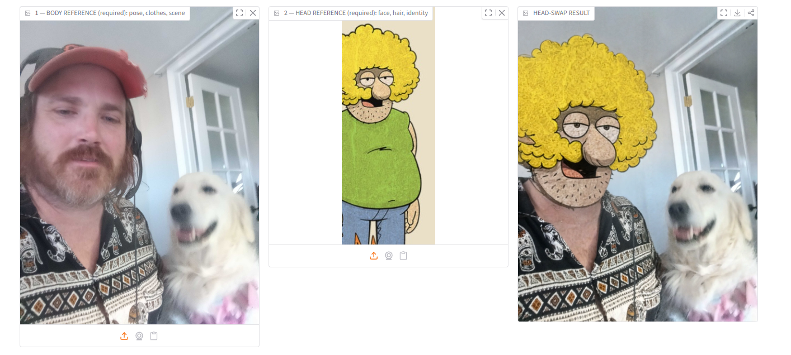
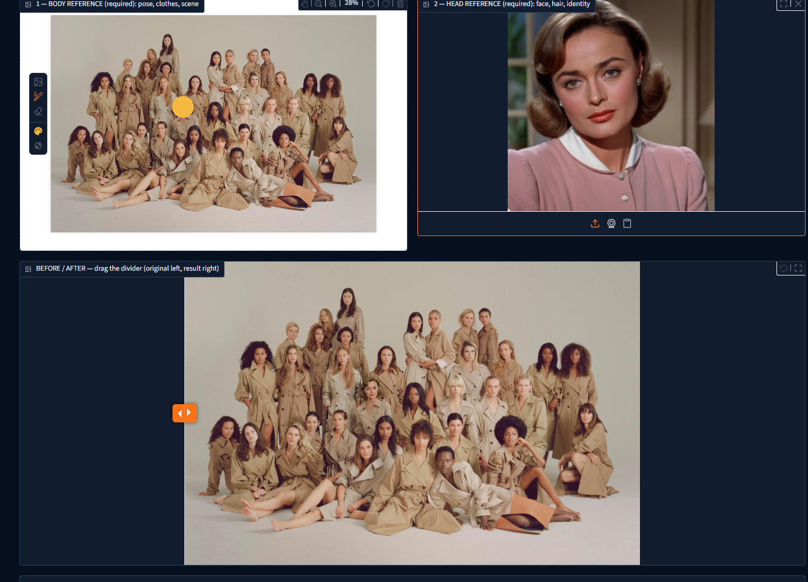

# Floyd Headliner — Likeness Transfer

Settings includes **Release models / free GPU memory** and **Stop server**.
Release unloads both inference engines while keeping the app and phone link open.
The next generation reloads models automatically. Stop server asks for confirmation
and requires restarting 2-START-Floyd-Headliner.bat on the local PC. Finish active
generation first. The release button is also available on Likeness Transfer.

## A Get Going Fast Application

### [Quick Setup Helper → GetGoingFast.pro/tools/floydheadliner](https://getgoingfast.pro/tools/floydheadliner)

For walkthroughs and updates, visit
[The AI Hobby Guy on YouTube](https://youtube.com/@theaihobbyguy).

Floyd Headliner is a local Windows likeness-transfer app: provide a **body reference**
for pose, clothing, and scene, then a **head reference** for face, hair, and
likeness. It recreates the active image-edit path from
`Qwen-Image-2_1-BFS-Character-Swap-Image-Edit-I2I.json` as a direct Python app.
Neither likeness-transfer engine requires a ComfyUI installation or server.
The optional Fast core includes the inference modules it needs inside this
app, similarly to MagicQuill's embedded-core approach.

The Qwen Image 2.1 base model and BFS/Viggle adapters come from their original
publishers; Get Going Fast does not claim ownership of those models.

## Optional network access

Headliner opens on this computer only by default. In the app's **Settings** tab,
you can choose **Local network (LAN)** or a **Temporary public link**. A password
is optional: any nonblank password is accepted, and an empty password means no
login, including when replacing a previously saved password. If you set a
password but leave the username blank, the username defaults to `ggf`. Close
and restart the app to apply the change. The current address is shown in
Settings and in the server window. With no login, anyone with the address can
generate images and change app settings. A public link exists only while the
app is running.

When a password is set, its salted hash is saved locally in
`network_settings.json`. That file is excluded from Git and must not be
included in shared ZIPs.

## Install and run from source

For guided setup, use the [Quick Setup Helper](https://getgoingfast.pro/tools/floydheadliner)
at Get Going Fast. This public repository contains the app source; the
one-click setup package is a separate Get Going Fast member offering.

For manual source setup, install [uv](https://docs.astral.sh/uv/getting-started/installation/),
then open **Command Prompt** in the directory where you want the repository:

```bat
git clone https://codeberg.org/Cognibuild/Floyd-Headliner
cd Floyd-Headliner
uv venv --python 3.11 .venv
uv pip install --python .venv\Scripts\python.exe --upgrade pip setuptools wheel
uv pip install --python .venv\Scripts\python.exe torch==2.10.0 torchvision==0.25.0 torchaudio==2.10.0 --index-url https://download.pytorch.org/whl/cu130
uv pip install --python .venv\Scripts\python.exe -r requirements.txt
.venv\Scripts\python.exe download_models.py
.venv\Scripts\python.exe download_fast_models.py
.venv\Scripts\python.exe app.py
```

For the lower-VRAM mode, install `bitsandbytes==0.50.2` into the private
environment and select the smaller six-step Viggle adapter before starting:

```bat
.venv\Scripts\python.exe -m pip install bitsandbytes==0.50.2
.venv\Scripts\python.exe download_models.py --profile low-vram
.venv\Scripts\python.exe app.py
```

The [Quick Setup Helper](https://getgoingfast.pro/tools/floydheadliner) offers
this choice during installation. The low-VRAM mode quantizes the existing Qwen
transformer and text encoder to 4-bit NF4 at load time, uses component CPU
offload and Viggle's rank-128 six-step LoRA. It still downloads the same roughly
35 GB Qwen base checkpoint. Switching profiles preserves already downloaded
model files; `download_models.py --profile standard` restores the original mode.
The current low-VRAM profile is aimed at approximately 16 GB GPUs; 12 GB cards
have not been verified and may run out of memory. Keep other GPU apps closed.

### Switching installed modes at startup

Start the app normally. If both standard and low-VRAM model variants are
downloaded, the console offers Standard, Low VRAM, and Experimental 12 GB.
Press Enter to reuse your last selection. No reinstall or model download is
needed to switch. With only one model variant installed, startup is automatic;
a low-VRAM-only install retains its selected 16 GB or experimental 12 GB mode
(both use the same weights). Close the running app before changing modes.
For an explicit choice without a menu, use `app.py --profile standard`,
`app.py --profile low-vram`, or `app.py --profile low-vram-12gb` with the private
environment's Python. Non-interactive launches reuse the available saved mode.

### Experimental 12 GB details

The Quick Setup Helper now offers **3. Experimental 12 GB**. For manual source
setup, install the bitsandbytes dependency above, then run
`download_models.py --profile low-vram-12gb` with the private environment's Python.
Restart the app after switching profiles. Updates preserve the selected profile.

This mode keeps both identity/turbo adapters, uses NF4 and component CPU offload,
limits the working canvas to 0.5 MP (704 × 704 for square images), resizes
references to about 512 × 512 worth of pixels, and disables transformer KV
caching. The limits apply to both Likeness Transfer and Inpaint. Fine detail may
be reduced; output upscaling does not restore lost detail. It still needs the
same base-model download and substantial system RAM.

Two-reference, six-step smoke test on an RTX 4090 with a **10.5 GiB PyTorch
allocation cap**: load 25.26 s; first generation 10.04 s; cached generation
6.66 s; peak allocated 10.03 GiB / reserved 10.09 GiB. Loading is excluded from
generation times. This is a memory-budget simulation, **not an actual 12 GB GPU
benchmark**; CUDA/desktop memory outside PyTorch is additional. Real-card speed,
available RAM, image quality, and reliability still need user testing. Close other
GPU apps before testing. Standard mode remains unchanged.




In the app, add the body/base image on the left and the head reference in the
middle. Optionally enter an **Extra prompt** such as “Remove the hat.” Click
**Transfer likeness** for a full-size result, or press **Ctrl+Enter** for a
half-size Turbo preview on the standard profile. Generated PNG files are saved in
`outputs/` in this source checkout.

On a standard-profile install, **Turbo preview · half-size** runs the same
generation at about half the selected working width and height, keeping the
image's aspect ratio. It saves the preview at that smaller size without 2×
output upscaling. The step count and likeness LoRA settings are unchanged.
This is a speed/quality preview, not a high-resolution final render. For a
painted-area edit, the preview is resampled after compositing, so unpainted
pixels will not remain byte-identical to the full-resolution input.

On the **Inpaint** tab, upload one image, type an instruction such as “remove the
hat,” and click **Generate edit (full size)** for a full-size result or press **Ctrl+Enter**
for a Turbo preview on the standard profile. The result appears
beside the input with a before/after slider. **Use result for the next edit**
loads it as the new input. This is prompt-based full-image editing: the model may
also change details outside the requested object. No drawing or mask is used.
Switching to Likeness Transfer and back leaves the Inpaint result in place;
uploading or clearing the input, or using the result as the next input, clears
the old comparison.
Inpaint runs the base Qwen Image 2.1 model with both LoRAs disabled. Its default
is 40 steps because the six-step setting depends on the Viggle Turbo LoRA.
After an edit, **Send result to Likeness Transfer** places that result in the
body reference slot and opens the Likeness Transfer tab. The head reference is
left unchanged. **Use result as new body reference** on Likeness Transfer now
clears the previous editor image and loads the result with one click.
The BFS and Viggle Turbo LoRAs remain available in Likeness Transfer.
On a standard-profile installation, Inpaint now uses the same app-local Qwen
inference core as Fast core likeness transfer. Low-VRAM profiles retain their
existing Diffusers offload path until the core is validated on those GPUs.
The Inpaint tab has the same **Turbo preview · half-size** option on the
standard profile. It saves the smaller native working image instead of
resizing it back to the uploaded image's dimensions. Use the regular button
for the full-size result. On low-VRAM profiles, Ctrl+Enter falls back to the
regular button because Turbo preview is unavailable there.

### Optional fast likeness engine

On a standard-profile installation with the app-local fast-core model files,
**Advanced likeness settings →
Likeness-transfer engine** offers **Fast core** and **Standalone**. Fast core
is selected by default when detected. The same body/head inputs, prompts,
before/after slider, painted-area controls, result reuse, and Inpaint tab
remain in the existing interface. On the standard profile, Inpaint uses this
same loaded core with both LoRAs off. Switching operations changes the model
adapter selection without starting a second app or server.

The app-local core is currently experimental. Its source modules are in
`vendor/comfy_core/` and run under this app's `.venv`; its INT8 model and text
encoder plus VAE are in `models/fast-core/`. The standard-mode installer
downloads these three model files (about 17 GB total) and reuses the existing
BFS and Viggle LoRAs. No ComfyUI application, server, or Python environment is
installed. Low-VRAM profiles keep the standalone engine because the core has
only been tested on the local RTX 4090. The embedded Comfy-derived modules are
third-party GPLv3 code; see `vendor/comfy_core/LICENSE` and `SOURCE.md` there.

Matched local speed check: two fixed reference images, 1376 × 768 working
canvas, six steps, 2× output, and four seeds. Including model/worker startup,
the first image took 22.5 seconds with Fast core versus 37.5 seconds with
Standalone. Cached repeats had medians of 4.1 versus 9.3 seconds. Results
are not pixel-identical because the engines use different model precision
and sampling. Review output quality before adopting Fast core for a release.

For likeness transfer, **Protect painted area (experimental)** hides painted heads
from the input seen by the model, then restores those regions from the original.
Cover the entire head, including hair, and leave one target head visible. Painting
enables **Use painted mask**. Unlike **Edit painted area**, the unprotected image
can change. Protected results retain the original image dimensions. The experiment
passed a two-portrait test with exact protected-pixel restoration, but target choice
and changes outside the mask remain dependent on the model.

## What is reproduced

- Qwen Image 2.1 app-local core inference on the standard profile; Diffusers
  remains available for likeness transfer and low-VRAM Inpaint
- Body/base as `<image1>` and head reference as `<image2>`
- `bfs_head_v1.1_alternative_qwen_2.1.safetensors` at strength 1.0
- `Qwen-Image-2.1-viggle-turbo-v0.2.1-6step-lora-r256.safetensors` at strength 1.0
- Six denoising steps and CFG 1.0
- About a 1 MP ratio-preserving working canvas, rounded to multiples of 32
- 2x Lanczos output scaling
- Automatic GPU residency or CPU/GPU offload according to available VRAM

The optional low-VRAM profile changes the precision and uses Viggle's 680 MB
rank-128 cut instead of the 1.36 GB rank-256 adapter. It is not expected to
produce identical pixels to the standard profile.

Diffusers uses Qwen Image 2.1's official FlowMatch Euler scheduler. It is the
standalone pipeline equivalent, not ComfyUI's `KSampler` implementation, so the
same seed is not expected to produce a pixel-identical image.

## Faster repeat transfers

The app caches the last prompt plus its body/head references and two deterministic
VAE reference encodings in system RAM. Both reference images, their ordering,
and the prompt are part of the cache key. Changing the seed or LoRA strengths
does not require re-encoding unchanged references. No denoising steps are skipped.

With at least 22 GiB of free VRAM at model load and a canvas up to about 1 MP,
the default fast mode retains the image transformer and VAE on the GPU. The text
encoder runs only when needed and returns to system RAM. Larger canvases or the
unchecked **Keep model on GPU** option use component CPU offload; a busy GPU
at startup selects slower sequential offload. On a mostly free 24 GB card, larger
512-pixel VAE tiles reduce encoding/decoding overhead. Tiling can slightly change
pixels versus the old 256-pixel tiles; steps, resolution and adapters are unchanged.

First generation includes model loading. New references or a changed prompt are
slower than repeated transfers using the same inputs. The result status reports total
time, memory mode and cache reuse. Fast mode holds substantial GPU memory between
transfers: click **Release models / free GPU memory** before running another GPU app.
This clears memory only, never downloaded models or saved images. The next transfer
reloads the models. Restart the app to load code updates.

Local RTX 4090 verification (six steps, 864 x 1248 working canvas, 1728 x 2496 PNG):
the previous build took 32.8 seconds initially and 23.3 seconds warm. The updated
build took 22.9 seconds for initial conditioning and 8.7-8.8 seconds for repeated
inputs. A changed head reference took 20.8 seconds. These measurements exclude
model loading, include saving the PNG, and are not a guarantee for every image.
At a fixed seed, cached and uncached runs of the updated build were pixel-identical.

Low-VRAM smoke test (RTX 4090, two synthetic references, 1024 × 1024 canvas,
six steps): standard BF16/rank-256 loaded in 12.2 s and generated in 22.8 s
first / 10.1 s with cached references, peaking at 22.6 GiB reserved. NF4/rank-128
loaded in 25.2 s and generated in 14.2 s first / 9.7 s cached, peaking at
13.1 GiB reserved. The low-VRAM run also passed with a 16 GiB PyTorch allocation
cap. These are one-machine smoke measurements, exclude saving a PNG, and are
not a guarantee on an actual 16 GB GPU or with different images.



## Requirements

- Windows 10/11 64-bit
- Python 3.10 or 3.11
- NVIDIA GPU with a recent driver; tested target is RTX 4090 24 GB
- Roughly 60 GB free disk space during setup
- About 64 GB system RAM recommended for bf16 CPU offload

The source setup above uses a private virtual environment in `.venv/` and
keeps downloaded models in `models/`.

## Model sources

- [Qwen Image 2.1 base model](https://huggingface.co/Qwen/Qwen-Image-2.1) — all repository model files belong in `models/Qwen-Image-2.1/`.
- [BFS identity LoRA](https://huggingface.co/Alissonerdx/BFS-Best-Face-Swap/blob/main/bfs_head_v1.1_alternative_qwen_2.1.safetensors) — save as `models/loras/bfs_head_v1.1_alternative_qwen_2.1.safetensors`.
- [Viggle Turbo six-step LoRA](https://huggingface.co/Viggle/Qwen-Image-2.1-viggle-turbo/blob/main/Qwen-Image-2.1-viggle-turbo-v0.2.1-6step-lora-r256.safetensors) — save as `models/loras/Qwen-Image-2.1-viggle-turbo-v0.2.1-6step-lora-r256.safetensors`.
- [Viggle Turbo rank-128 six-step LoRA](https://huggingface.co/Viggle/Qwen-Image-2.1-viggle-turbo/blob/main/Qwen-Image-2.1-viggle-turbo-v0.2.1-6step-lora-r128.safetensors) — selected only by the low-VRAM profile.

If a pinned Hugging Face LoRA download fails, `download_models.py` tries the
[BFS backup](https://drive.google.com/file/d/18ZKkYWDGzIWrFrrlYJrK--K7_b1wJZdG/view?usp=drive_link)
or [Viggle backup](https://drive.google.com/file/d/1VceHvGZXdu4sO2GJW5njn6ALC1EMW4XM/view?usp=drive_link)
on Google Drive and verifies the downloaded file's SHA-256 hash before use.
The Qwen base model has no Google Drive fallback.

`download_models.py` pins exact upstream revisions recorded on September 29, 2026.
The [Qwen Image 2.1 base model](https://huggingface.co/Qwen/Qwen-Image-2.1/blob/main/LICENSE)
and [Viggle Turbo LoRA](https://huggingface.co/Viggle/Qwen-Image-2.1-viggle-turbo/blob/main/LICENSE)
use the Qwen Research License. Their materials are limited to non-commercial
research/evaluation unless the licensor grants a separate commercial license.
The license for Floyd Headliner's code does not change those upstream terms.

Floyd Headliner is named in honor of the legend Count Floyd

## License

Floyd Headliner's own app code and documentation are source-available under the
[Floyd Headliner Community License 1.0](LICENSE). You may use, modify, and
share them for free; only Get Going Fast may sell or charge for the app without
separate written permission. This is not an open-source license. The earlier
GPL text is retained for historical revisions in
[COPYING.GPL-HISTORICAL](COPYING.GPL-HISTORICAL); previously granted GPL rights
remain in effect for those revisions. Contributions remain their authors'
property and need separate commercial permission before inclusion in a paid
version. Third-party models, adapters, and dependencies keep their own terms;
the Qwen and Viggle model licenses do not grant commercial model use by default.

## Source and Hosting Notice
Get Going Fast provides community setup guidance, documentation, tutorials, troubleshooting support, and member services. Get Going Fast does not sell, host, store, mirror, or redistribute AI model files, model weights, training datasets, or the third-party applications our guides cover. Those always come from their own official upstream sources.

A small number of setup files — example workflow, preset, and configuration files used by our installers and step-by-step guides — are served directly from Get Going Fast so that a documented setup stays reproducible for members. Where such a file originates with a third party we credit its author and link to the original project, and we will remove or repoint it promptly at the request of its author or rights holder.

The Get Going Fast Resource Library is a research index. It stores descriptions, categories, tags, ratings, and links only. Workflows, prompt packs, templates, presets, and similar files are never copied to or served from Get Going Fast servers — every entry links out to the original author's own source, and obtaining the file is subject to that source's license, terms, and availability.

When a setup guide references third-party dependencies, repositories, or model files, it points users to official upstream public sources such as GitHub, Hugging Face, package managers, or original project repositories, subject to those sources' own licenses, terms, and availability.

Get Going Fast is a general-audience AI education and workflow site, not an adult-content site or hosted AI generation service. Do not use Get Going Fast materials, support, guidance, or referenced third-party tools for unlawful, abusive, non-consensual, sexually explicit, exploitative, harassing, deceptive, or privacy-violating content, including misuse of another person's likeness, voice, identity, intellectual property, privacy, or publicity rights. See our Acceptable Use Policy.

If you are a rights holder, platform reviewer, payment processor, or hosting provider with a concern about a listed tool, guide reference, catalog entry, or upstream source, please contact us. We will review the concern promptly and remove or revise references when appropriate.
